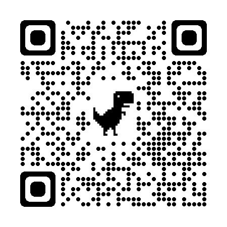

# Programming Notes

# 1-21-23

Updates from January 21st 2023

## Andy

- Today I commit the code of the buttons in the smart dashboard to I make with Irae to we made 1/19/2023
- I create the folder for the notes of the day 
- I help Nancy to calibrate the camera in photon vision 

## Nancy
- I set up the new camera onto minnie. I changed the name of the previous camera and named the new one the same as the previous one. This way I was still able to run the code that was on minnie using the new camera. Then I **calibrated the new camera to read the apriltags in 3D** and tested that minnie was still able to move and do the autonomous command that I told it to do in the code using the new camera. 

- **The new arducam is named "logi...."**

## Liz

Today I looked into **robot simulation code**. Robot simulation would enable us to test the robot without having to use an actual robot. Then I shifted gears towards **PID Tuning for an arm mechanism.** The PID Tuning would spin the arm to specific positions. However, I need to ramp the speed of the arm, as well as tune PID.

# 1-22-23

## Mentors

- Today we discussed trapezoidal motion smoothingas a possible solution to help the arm move smoother [Click on this Link to WPIlib docs for Trapezoidal smoothing](https://docs.wpilib.org/en/stable/docs/software/advanced-controls/controllers/trapezoidal-profiles.html)

## Nancy

- made the driveToTag command run in autonomous 
- made a vision constants inside constants   that holds a list of different setpoints
- added the get best fiducial to the initialize in the runToTag and made an array so that it runs a different distance based on the fiducial tag that the camera sees
- We initially had the get best fiducial in the robot container but since it would be constantly changing it did not accept it so moved it to the command

# Andy 
- i finish the answer electrical questions in slack

# 1-23-23

## Nancy

- Added a sensor subsystem 
- Imported the ultrasonic and smartdashboard imports in the sensor subsystem

### Issues for this week: 
- Add ultrasonic sensor to subsystem and create code that will print distance onto the smartdashboard

## Nancy 
 
 - put the ultrasonic sensor onto minnie 
 - put the port the sensor was connected to in constants 
 - tried different code to print the values from the sensor into the smartdashboard 
 - figured there was something wrong with analog input and analog potentiometer imports because we would not get the api that was mentioned in wpilib when both of those were imported
 - did research on code examples for ultrasonic sensors

# 1-26-23 

## Nancy 
- Created a new command called locateCube 
- Imported the vision and drivetrain systems and the smartdashboard 
- made an if statement saying to turn at .5  until it sees the target which was set to the cone and once it sees the cone it will go straight towards it at -.5 when Y is pressed on the controller 
- made public PhotonPipelineResult results = new PhotonPipelineResult() because the program was crashing on run  and we needed to set a default value on results pipeline

# 1-30-23

## Andy
- I updated the id of the can sparks max
- I researched network Table Instance's

# 2-1-23 

## Nancy 
- Made a new branch for auto that gets out of community zone and balances on charging station 
- New command called autoBalance 
- Command runs robot if position is < 1.3 else turns 
- Things to do still: correct code because position can be neg, make command run when a button is pressed, finish adding logic for robot to turn and balance

# 2-10-23

## Nancy
- Created an update odometry in drivetrain and called it in robot.java 
- Started looking at widget 2d 
- Put the field onto the smartdashboard
- Made a trajectory that would be seen on the smartdashboard 

# 2-11-23

## Nancy 

- Opened up glass and added client to be able to see our robot’s data
- Downloaded the field image and put it into glass 
- Deployed the code that would put the trajectory onto the field 
- Got 2d simulation running now we need to figure out how to put “firstpath” onto the field correctly  

# 2-22-23

## Andy 
- Read Binkin LED Driver and looked for examples 
- Created a branch for LED lights code 
- Connected LEDs to test board 

## Nancy 
- Researched about Rev colorsensor 
- Created a colorsensor subsystem 
- Wrote code for color sensor to tell RGB values and used that combination to create a color 
- Connected that color to a string that says cube or cone 
- Printed out cone and cube when the sensor sees either one 

# 2-23-23

## Nancy
-Today I will connect the leds and color sensor for lights to tell us what game piece the sensor senses

Today we worked on 

-nancy
